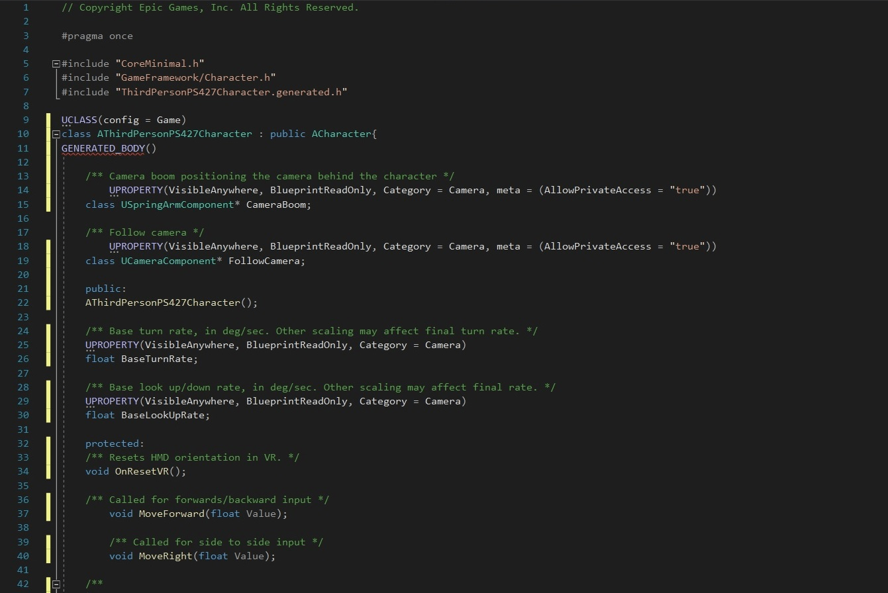

# Clang Format for Unreal Engine C++
The purpose of this repository is to provide a Clang-Format configuration for Unreal Engine C++ and instructions for how to use it.

## Get the .clang-format file
[.clang-format file](./.clang-format)

## VS Code
1. Put the `.clang-format` file in the root of your project (or the engine root if you are working on the engine itself).
2. As long as you have [Microsoft's C++ extension](https://marketplace.visualstudio.com/items?itemName=ms-vscode.cpptools) installed in VSCode you can now format with `Shift+Alt+F`. (If not, [read here](https://code.visualstudio.com/docs/cpp/cpp-ide#_code-formatting)).

**Optional:** You can enable `format on save` for C++ by adding the following to your `*.code-workspace` file:
```
"settings": {
		"[c++]": {
			"editor.formatOnSave": true
		}
	},
```

## Visual Studio
1. Go to the root of you project, `File->Add New Item->ClangFormat File`.
2. Copy+Paste the contents of the .clang-format from this repository into the newly generated `.clang-format` file. 
3. You can now format files with `Ctrl+K+D`

**Optional:** You can enable format on save by installing [this extension](https://marketplace.visualstudio.com/items?itemName=mynkow.FormatdocumentonSave).

